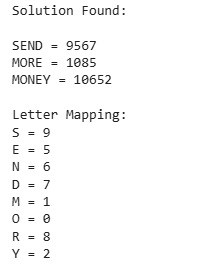

<h1>ExpNo 8 : Solve Cryptarithmetic Problem,a CSP(Constraint Satisfaction Problem) using Python</h1> 
<h3>Name:NARENDHRIRAN P               </h3>
<h3>Register Number:212224230177       </h3>
<H3>Aim:</H3>
<p>
    To solve Cryptarithmetic Problem,a CSP(Constraint Satisfaction Problem) using Python
</p>
<h3>Procedure:</h3>
Input and Output
<br>Input:
This algorithm will take three words.
<br> B A S E<br>
    B A L L<br>
           ----------<br>
           G A M E S<br>

Output:
It will show which letter holds which number from 0 – 9.
For this case it is like this.

              B A S E                         2 4 6 1
              B A L L                         2 4 5 5
             ---------                       ---------
            G A M E S                       0 4 9 1 6
Algorithm
For this problem, we will define a node, which contains a letter and its corresponding values.<br>

isValid(nodeList, count, word1, word2, word3)<br>

Input − A list of nodes, the number of elements in the node list and three words.<br>

Output − True if the sum of the value for word1 and word2 is same as word3 value.<br>

Begin<br>
   m := 1<br>
   for each letter i from right to left of word1, do<br>
      ch := word1[i]<br>
      for all elements j in the nodeList, do<br>
         if nodeList[j].letter = ch, then<br>
            break<br>
      done<br>
      val1 := val1 + (m * nodeList[j].value)<br>
      m := m * 10<br>
   done<br>

   m := 1<br>
   for each letter i from right to left of word2, do<br>
      ch := word2[i]<br>
      for all elements j in the nodeList, do<br>
         if nodeList[j].letter = ch, then<br>
            break<br>
      done<br>

      val2 := val2 + (m * nodeList[j].value)
      m := m * 10
   done<br>

   m := 1<br>
   for each letter i from right to left of word3, do<br>
      ch := word3[i]<br>
      for all elements j in the nodeList, do<br>
         if nodeList[j].letter = ch, then<br>
            break<br>
      done<br>

      val3 := val3 + (m * nodeList[j].value)
      m := m * 10
   done<br>

   if val3 = (val1 + val2), then<br>
      return true<br>
   return false<br>
End<br>
<hr>
<h2>Sample Input and Output:</h2>
SEND = 9567<br>
MORE = 1085<br>
<hr>
MONEY = 10652<br>
<hr>

## PROGRAM :
```py
from itertools import permutations

letters = ('S','E','N','D','M','O','R','Y')

digits = range(10)

for perm in permutations(digits, len(letters)):

    s,e,n,d,m,o,r,y = perm

    # Leading digits cannot be zero
    if s == 0 or m == 0:
        continue

    send = 1000*s + 100*e + 10*n + d
    more = 1000*m + 100*o + 10*r + e
    money = 10000*m + 1000*o + 100*n + 10*e + y

    if send + more == money:

        print("Solution Found:\n")

        print("SEND =", send)
        print("MORE =", more)
        print("MONEY =", money)

        print("\nLetter Mapping:")
        print("S =", s)
        print("E =", e)
        print("N =", n)
        print("D =", d)
        print("M =", m)
        print("O =", o)
        print("R =", r)
        print("Y =", y)

        break
```
## OUTPUT:


<h2>Result:</h2>
<p> Thus a Cryptarithmetic Problem was solved using Python successfully</p>
